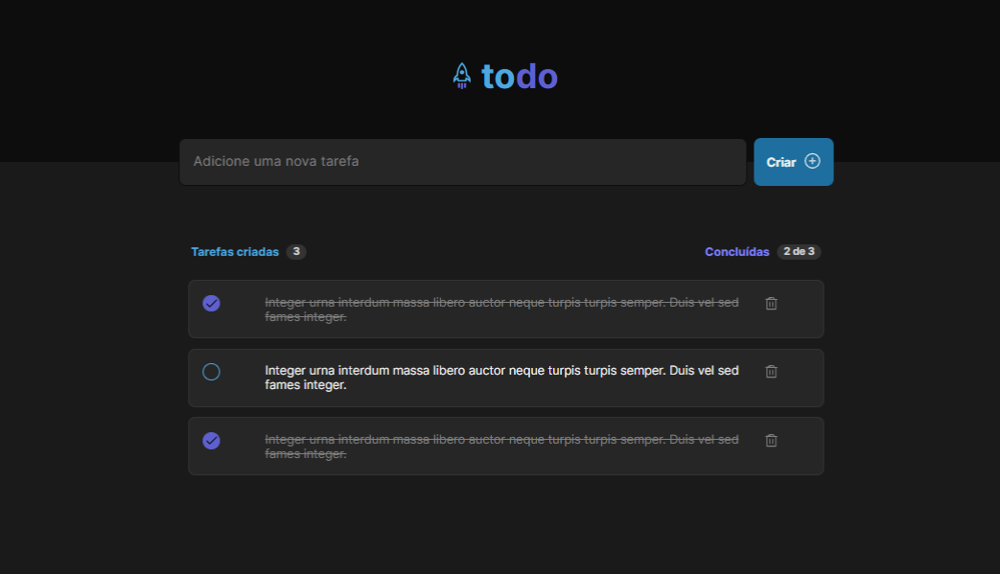

<h1 align="center"> ToDo List </h1>

 

  
  

  <em>Confira o resultado do app em: https://todo-list-hevelin.vercel.app/</em>

## 💻 Projeto

ToDo List é uma aplicação de controle de tarefas que permite:

- Adicionar uma nova tarefa
- Marcar e desmarcar uma tarefa como concluída
- Remover uma tarefa da listagem
- Mostrar o progresso de conclusão das tarefas

Para o desenvolvimento dessas funcionalidades, foram utilizados conceitos como:

- Estados
- Imutabilidade do estado
- Listas e chaves no ReactJS
- Propriedades
- Componentização

## 🚀 Tecnologias

Esse projeto foi desenvolvido com as seguintes tecnologias:

- HTML
- CSS
- TypeScript
- React
- Git e Github
- Vite
- Figma
